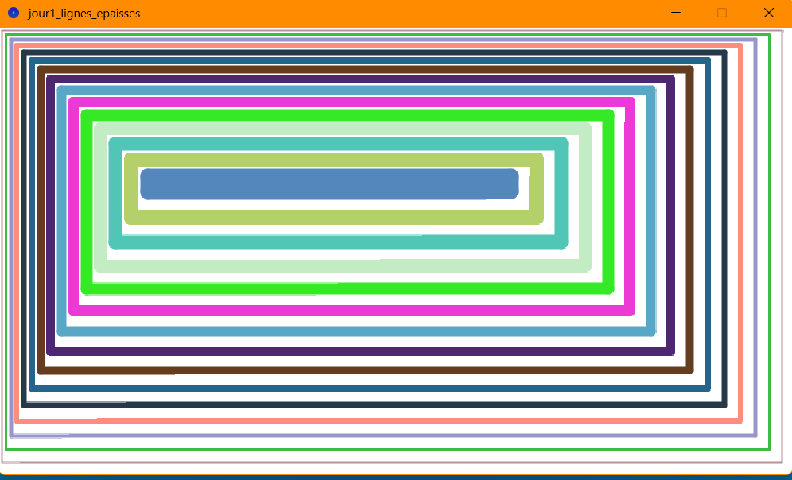
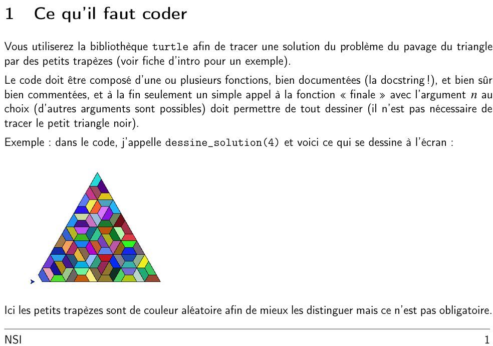
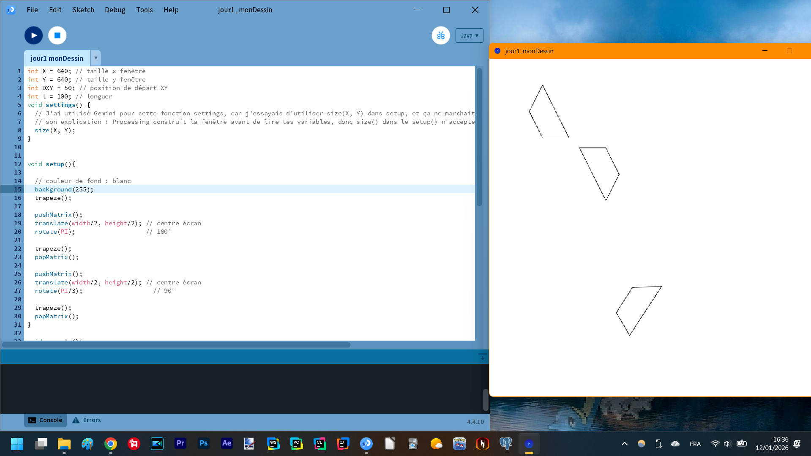
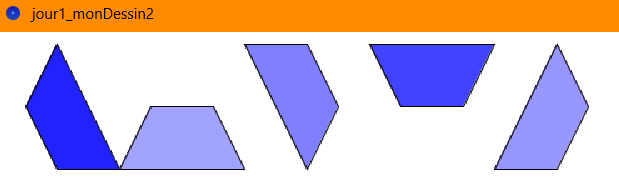
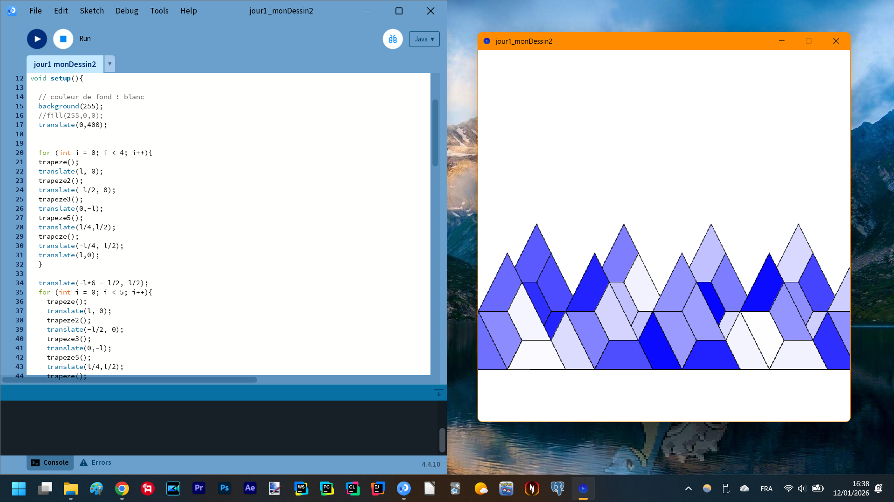
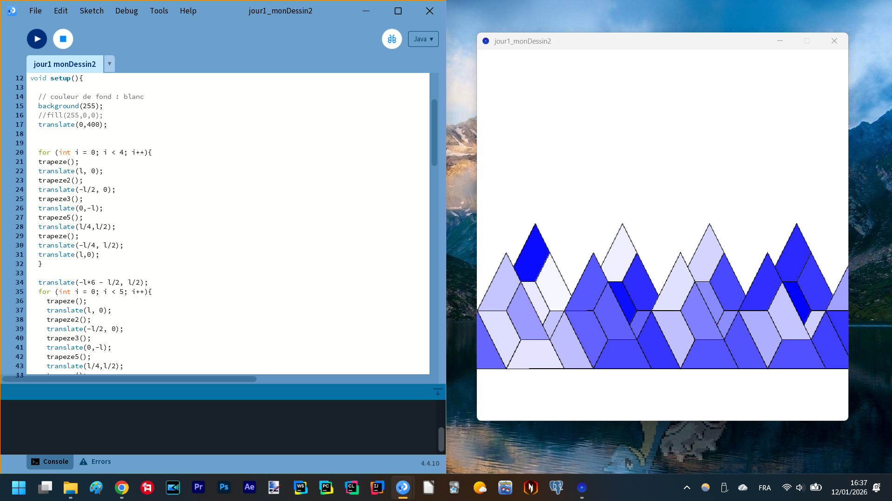

Matthieu FARANDJIS\
E3 IMAC

# Jour 1 - Workshop Esthétiques algorithmiques

---

 
Algorithmic drawing
   

**Arborescence**\
Algorithmic drawing\
│   ├── jour1_lignes_epaisses : dossier avec le fichier .pde contenant le code Processing pour cette figure\
│   ├── jour1_monDessin2 : dossier avec le fichier .pde contenant mon code pour l'atelier 1.2\
│   ├── jour1_screenshots : comporte les captures d'écran pour le README\
│   ├── jour1_tentatives : comporte un dossier avec le fichier .pde de ma tentative de rotation de trapèze\
  

---

## Plan

- ## [I – Atelier 1.1](#p1)
- ## [II – Atelier 1.2](#p2)

---

##  I - Atelier 1.1
Parmi les figures du livre, j'ai choisi celle qui me semblait être la plus simple : la figure des lignes épaisses.\
J'ai copié le code en BASIC pour le traduire en Java ligne par ligne, en essayant de voir s'il existait des fonctions similaires avec Processing.\
Cela explique mon choix d'utiliser des lignes plutôt que des rectangles.\
En discutant avec Raphaël, j'ai vu qu'il utilisait `strokeWeight` pour modifier l'épaisseur des traits, ce que je ne savais pas faire.\
\
Mettre de la couleur a été simple en regardant la documentation sur Internet.

*Figure "lignes épaisses" colorée, résultat de l'Atelier 1.1*

     

---

##  II - Atelier 1.2
Pour la création originale, j'ai voulu m'inspirer d'un devoir que j'avais fait en spécialité NSI en terminale.

*Extrait du sujet de NSI : ma source d'inspiration*

\
\
\
L'idée était de faire un triangle composé de trapèzes, à partir d'un simple trapèze, avec la librairie Turtle en Python.\
Seulement, Turtle dessine un dessin à l'aide d'un curseur que l'on déplace, alors qu'avec Processing, on indique les coordonnées des formes à dessiner.\
Ce qui fait que l'idée de dessiner un seul trapèze et de le faire tourner est difficile, même en demandant de l'aide à ChatGPT pour voir comment effectuer une rotation de mon dessin de trapèze.

*Tentatives de changer la rotation des trapèzes*

\
\
\
J'ai alors préféré créer chaque position de trapèze manuellement et déplacer les coordonnées à l'origine à l'aide de la fonction `translate`.\
C'est une fonction par type de trapèze. Je n'avais pas d'idée de nom pour chaque trapèze, alors je les ai numérotés.\
Ce qui a été compliqué, c'était de m'assurer que les différents trapèzes pouvaient s'imbriquer.

*Mes différents trapèzes (dans l'ordre : trapèze, trapèze2, trapèze3, trapèze4, trapèze5)*

\
\
\
Faire un grand triangle composé de différents triangles composés de trapèzes aurait été difficile.\
En réfléchissant, j'ai voulu dessiner des montagnes à partir de ce que j'avais commencé à faire.\
J'ai fait une ligne de plusieurs triangles dessinés à la suite, ainsi qu'une autre rangée. Chaque trapèze est coloré d'une nuance de bleu aléatoire, car la couleur bleue et le blanc sont associés au froid, à la glace, à la neige et donc aux montagnes.

*2 captures d'écran de mes magnifiques montagnes : les couleurs changent*

\
\
\
\
Remarque : ce rapport a été relu par ChatGPT afin de corriger les dernières fautes d’orthographe restantes. J’ai précisé de conserver la structure de ce que j’avais écrit ; il a uniquement corrigé les fautes et j’ai vérifié ses corrections.