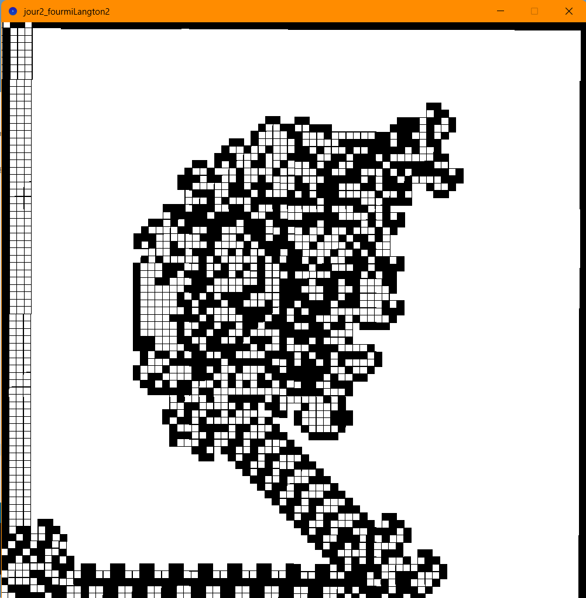
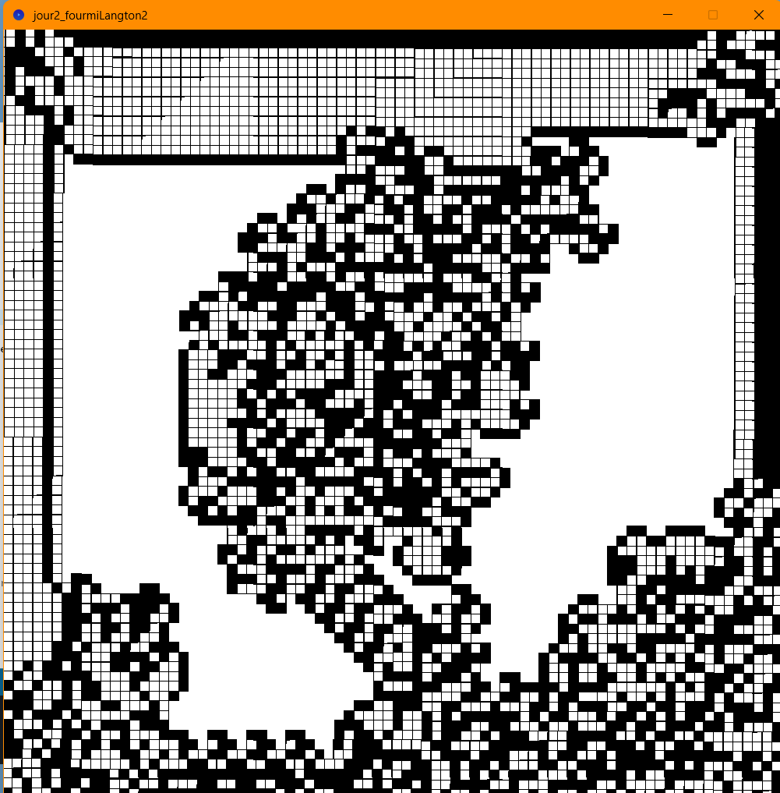
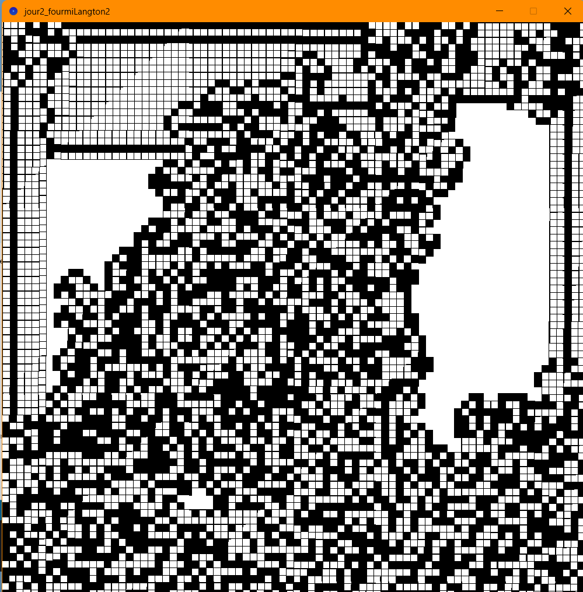
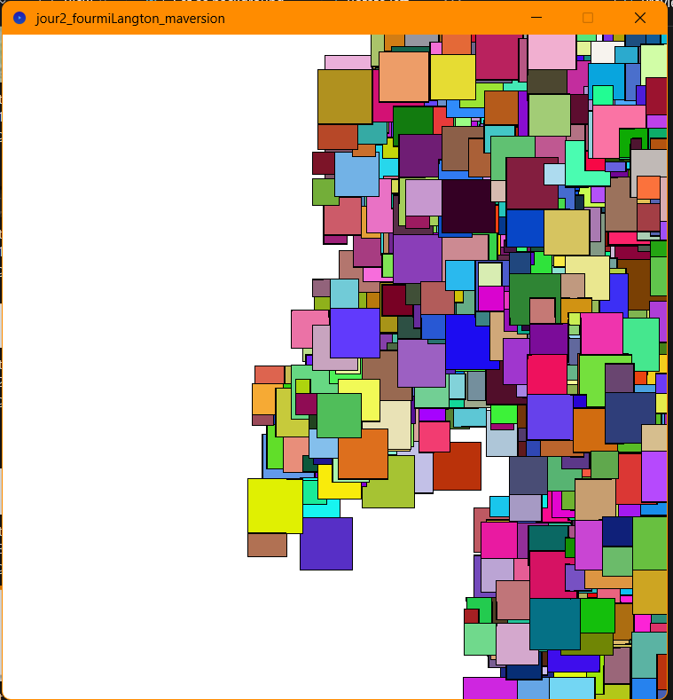
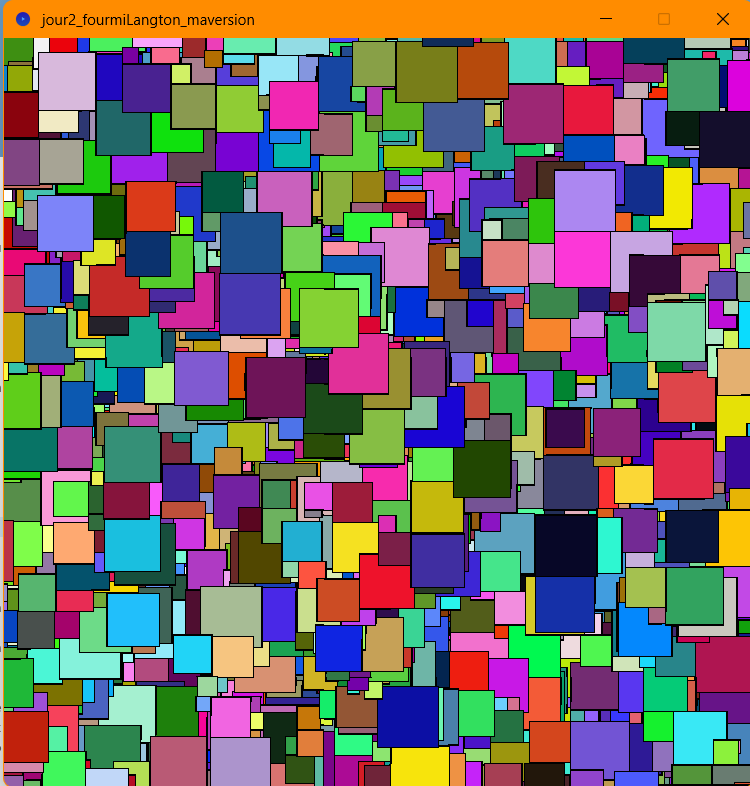
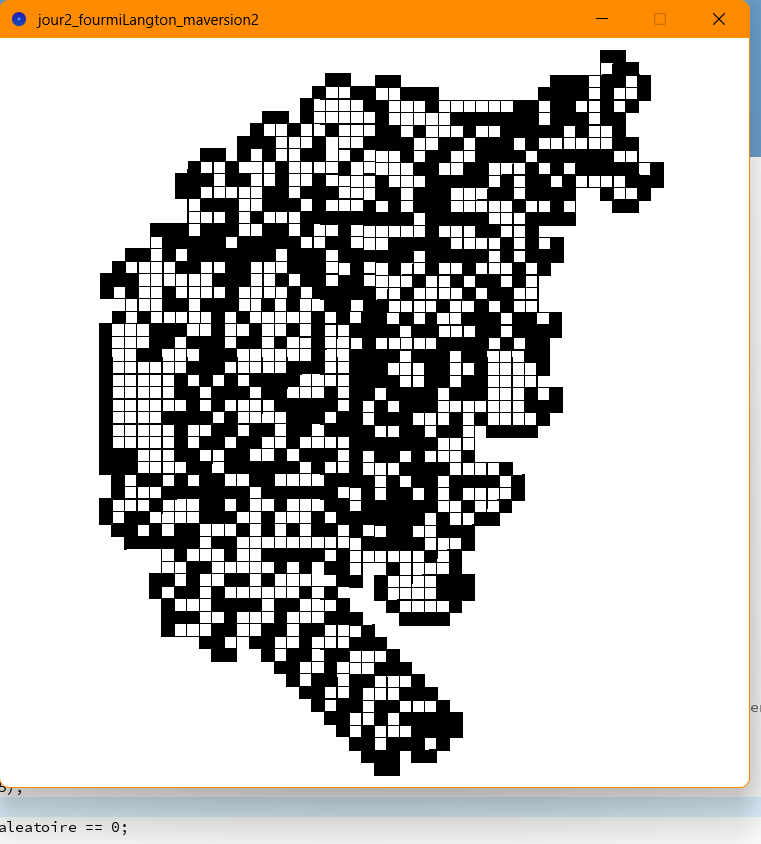
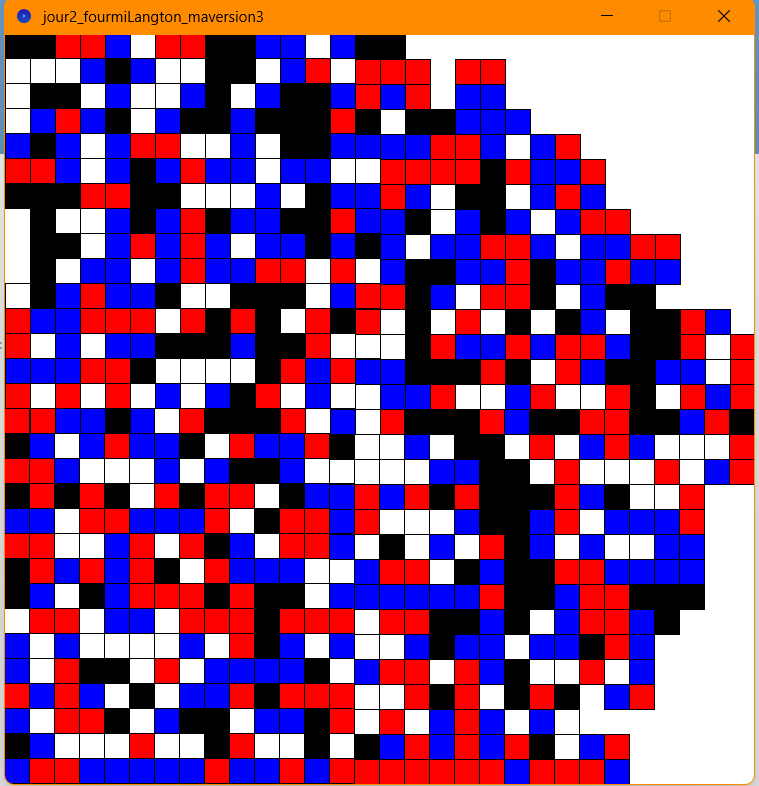

Matthieu FARANDJIS\
E3 IMAC

# Jour 2 - Workshop Esthétiques algorithmiques

---

 
Cellular Automata
   

**Arborescence**\
Cellular Automata\
│   ├── jour2_fourmiLangton_original : code Processing avec l'algorithme original de la fourmi de Langton\
│   ├── jour2_fourmiLangton_maversion : code Processing avec l'algorithme, version cases de différentes tailles et d'une couleur aléatoire.\
│   ├── jour2_fourmiLangton_maversion2 : code Processing avec l'algorithme, version fourmi de Langton... Mais il y a 1 chance sur 10 000 qu'elle soit perturbée.\
│   ├── jour2_fourmiLangton_maversion3 : code Processing avec l'algorithme, version fourmi de Langton avec deux actions et couleurs supplémentaires. **préféré**\
│   ├── jour2_fourmiLangton_screenshots : les captures d'écran
  

---

## Plan

- ## [I – Atelier 2.1](#p1)
  - ### a) Exploration : La fourmi de Langton
  - ### b) Ma version originale et inédite de la fourmi de Langton

---

##  I - Atelier 2.1
### a) Exploration : La fourmi de Langton

J'ai découvert la fourmi de Langton l'an dernier lors de mon stage au sein du laboratoire DAVID de mon ancienne université, et j'ai beaucoup aimé cet automate cellulaire. J'ai donc décidé de le reprendre.\
La présentation de l'algorithme est disponible sur Wikipédia : https://fr.wikipedia.org/wiki/Fourmi_de_Langton \
\
\
J'ai recréé moi-même l'algorithme indiqué sur la page. Je me suis toutefois aidé de Gemini à cause des limitations de Processing : \
Au départ, j'utilisais les fonctions rotate et translate réparties. Et autant cela fonctionnait pour une utilisation manuelle (en écrivant le code en dur), autant ça ne marchait pas une fois dans une boucle (donc automatisée).\
À chaque nouvelle exécution automatique de draw(), les coordonnées à l'origine et l'orientation étaient réinitialisées, ce qui rendait rotate et translate inutilisables.\
Gemini m'a conseillé de passer par trois variables globales : antX, antY, antAngle que l'on mettra à jour à chaque déplacement. À l'aide d'un calcul mathématique, nous appliquons la rotation à antX/Y, qui seront les coordonnées du nouveau carré.\
\
\
\
Quelque chose d'important à remarquer : lorsque la fourmi ne peut pas dépasser le bord ! Cela l'empêche donc d'avancer et elle est contrainte de s'orienter jusqu'à pouvoir avancer.\
Cela explique les contours noirs tout autour de la fenêtre dès qu'elle percute le bord.\
Il y a différentes façons de gérer lorsqu'elle percute le bord : la laisser faire... La refaire partir dans l'autre sens... Là, j'ai laissé ce que faisait Processing par défaut.\

*On remarque l'autoroute qu'a formée la fourmi (en bas à droite) avant de percuter le bord, l'encourageant à colorier le contour sur l'image 1*

   

### b) Ma version originale et inédite de la fourmi de Langton
J'ai modifié l'algorithme original que j'ai redéveloppé sur Processing pour voir comment la fourmi allait réagir. Voici 3 expérimentations.\
La seule expérimentation ne faisant pas appel à l'aléatoire étant la dernière (celle avec les cases rouge/bleu/noir/blanc), je retiens cette expérimentation comme ma version finale, ma préférée.\
\
#### 1. Cases de différentes tailles et d'une couleur aléatoire.
J'ai repris l'algorithme, mais pour chaque case, une couleur aléatoire est tirée au sort.\
Au moment de construire le carré, on tire au sort une valeur entre 10 et 50 que je définis comme taille du carré. La fourmi se déplace de cette longueur pour le prochain carré.\
\
Je constate :
- la fourmi peut se bloquer au bord ; dans ce cas-là, souvent il ne se passe plus rien
- la fourmi a plutôt tendance à rester à droite de la fenêtre et va peu souvent à gauche.

*Résultat de l'expérimentation 1*

   

#### 2. Fourmi de Langton... Mais il y a 1 chance sur 10 000 qu'elle soit perturbée.
J'ai repris l'algorithme de Langton, mais il y a une chance sur 10 000 que, peu importe la couleur de la case, elle fasse comme si elle était blanche.\
J'appelle ça une perturbation de la fourmi.\
\
Je constate :
- malgré la perturbation aléatoire, la fourmi va quand même sur l'autoroute. Il pourrait être intéressant d'explorer davantage cette expérimentation pour voir à quel moment elle est suffisamment perturbée pour ne plus s'y rendre.

*Résultat de l'expérimentation 2*

   

#### 3. (préféré) Fourmi de Langton avec deux actions et couleurs supplémentaires.
J'ai ajouté les couleurs rouges et bleues, et deux actions : reculer et avancer. J'ai modifié les règles, donc le blanc et le noir ne font pas les mêmes actions que dans le code original.\
\
Je constate :
- la fourmi ne va plus sur l'autoroute
- elle fait pire : elle se coince en bas à gauche et semble pousser une case bleue, puis fait apparaître une nouvelle case et ainsi de suite avant de tout effacer avec du rouge et recommencer. C'est très amusant à voir.\
  \
  Voici une vidéo de la fourmi bouclant en bas à gauche en poussant sa case bleue : https://www.youtube.com/shorts/VJmRg87QQ34

*Résultat de l'expérimentation 3*

     

Remarque : ce rapport a été relu par ChatGPT afin de corriger les dernières fautes d’orthographe restantes. J’ai précisé de conserver la structure de ce que j’avais écrit ; il a uniquement corrigé les fautes et j’ai vérifié ses corrections.
