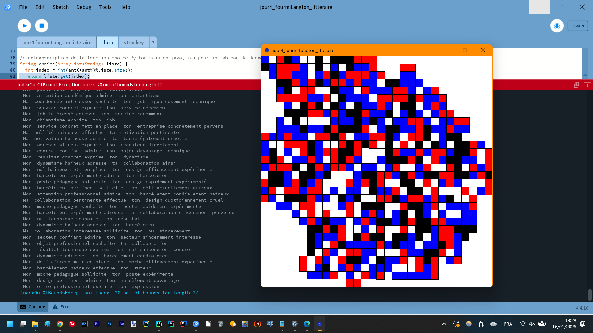
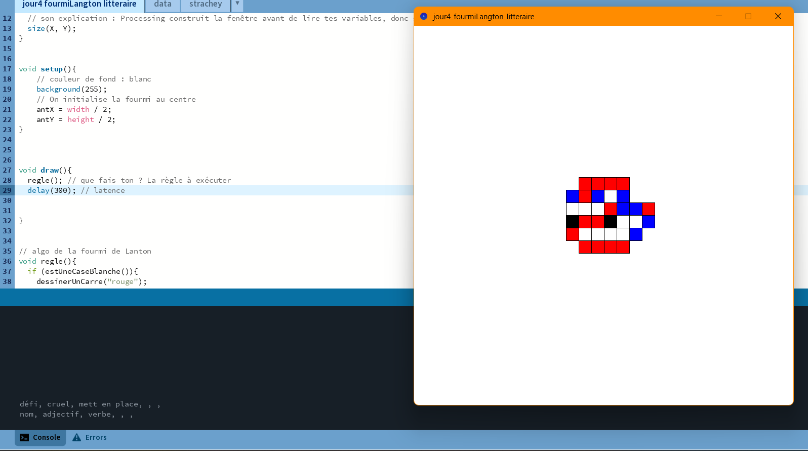

Matthieu FARANDJIS\
E3 IMAC

# Jour 4 - Workshop Esthétiques algorithmiques

---

 
Digital littérature
   

**Arborescence**\
Digital littérature\
│   ├── jour4_fourmiLangton_litteraire : mon projet personnel (langton litteraire)\
│   ├── strachey.py: mon adaptation de l'algo du poème (atelier 4.1)\
│   ├── screenshots : les images

  

---

## Plan

- ## [I – Atelier 4.1 : l'algorithme de Strachey](#p1)
- ## [II – Atelier 4.2 : la fourmi de Langton littéraire](#p2)

---

##  I - Atelier 4.1 : l'algorithme de Strachey

### 1. Réécriture de l'algorithme
J'ai récupéré le script Python de Nick Montfort https://nickm.com/memslam/love_letters.py et traduit les mots en français avec ChatGPT.\
J'ai essayé de réajuster les tournures de phrase pour qu'elles soient plus françaises, mais aussi de faire la distinction entre le féminin et le masculin pour mon/ma.\
J'ai utilisé l'IDE PyCharm de Jetbrains. Je n'ai rien installé pour faire fonctionner le code.

### 2. Changer le thésaurus
J'ai changé les différents mots par des mots venant de lettres de motivation afin d'en faire un générateur de lettres de motivation.\
Pour le plaisir, j'ai remplacé certains mots dans les listes par des mots déplacés comme : "haineux", "coquin", "crever", "généré par ChatGPT".\
\
Voici des extraits de la génération :

> Bonjour,\
Vous êtes ma violence coquine: mon expertise haineux. Votre offre est mon
objectif sociable: mon attention raté. Votre offre est mon chiantisme
expérimenté.\
\
Votre candidat généré par ChatGPT\
\
M.U.C.

> Bonsoir,\
Votre offre est mon nul technique: mon contrat intéressé .Votre offre est mon
harcèlement professionnel: mon poste coquin. Votre offre est mon succès haineux.\
\
Votre candidat technique\
\
M.U.C.

>Bonsoir,\
\
Vous êtes ma tâche adaptable: mon tuteur impliqué. Votre offre est mon cv coquin:
mon secteur passionné. Votre offre est mon mail passionné.\
\
Votre candidat pervers\
\
M.U.C.

     

---
##  II - Atelier 4.2 : la fourmi de Langton littéraire

### 1. Algorithme très résumé

Et si nous remplacions les appels à la librairie random par la fourmi de Langton ?\
C'est l'idée que j'ai eue. J'ai repris mon rendu du Jour 2. Voici l'attribution des couleurs :
- Adjectif (optionnel) : rouge
- Nom : bleu
- Adverbe (optionnel) : noir
- Verbe : blanc

Sachant qu'une phrase est composée de cette manière : nom1 -> (adj1) -> verbe -> nom2 -> (adv) -> (adj2)

Le mot est sélectionné en calculant le modulo de l'addition des positions X et Y avec la taille de la liste dont on veut récupérer le mot :
`int(antX+antY)%liste.size()`.\  
À partir de là, on récupère l'indice, que j'appelle ID, du mot que l'on va récupérer dans la liste.

\
Ma phrase est un tableau de 6 cases où j'ajoute, à chaque passage, sous condition, le mot associé à la couleur.

Par exemple, voici les conditions pour accepter l'ajout d'un nom :
- C'est le premier mot de la phrase : nom1
- Sinon, s'il y a un verbe dans la phrase, c'est nom2

Le nom a une particularité :
- si nom1 et nom2 sont déjà pris, on estime que la phrase est terminée et donc que ce nom est pour la nouvelle phrase.

\
De cette manière, nous avons au strict minimum une phrase simple : nom + verbe + nom, ou une phrase longue avec noms, adjectifs, adverbes et verbe.

### 2. Difficultés rencontrées
Je rends ce travail en retard. En effet, non seulement la traduction anglais -> français de l'algorithme en Python a été plus dure, mais j'ai aussi oublié de m'occuper des phrases longues.\
J'ai commencé mon projet personnel avec les phrases longues non corrigées, j'ai donc dû tout reprendre.\
\
J'ai aussi eu une difficulté avec le choix de la structure de données : tableau, ArrayList... Puisqu'en fonction de la structure, je ne peux pas utiliser certaines fonctions pourtant bien pratiques.

### 3. Améliorations possibles
Il y en a quelques-unes :
- Former le poème : j'avais commencé puis abandonné de le faire, il n'y a que les phrases longues
- Corriger le bug du plantage : le programme plante au bout d'un moment
- Implémenter les phrases courtes du poème (les phrases "shorter")
- Terminer l'implémentation du fait qu'un adjectif ou un adverbe peut finalement ne pas être dans la phrase :
    - mon idée était que lorsqu'on retrouve un nouvel adjectif/adverbe alors que nous en avons déjà un à l'emplacement attendu, on le retire.\
      Si on en trouve un troisième, on le remet (car on n'en a plus). J'estimais que c'était un moyen de reproduire l'aspect aléatoire de la présence d'un adjectif/adverbe.\
      J'ai l'impression que seul l'adjectif a été implémenté, mais je ne suis pas sûr que ce soit fonctionnel.

### 4. Images

*Bug du plantage avec l'erreur : IndexOutOfBoundsException: Index -20 out of bounds for length 27*
 
*On remarque les dernières phrases générées par l'algorithme dans la console.*

   

*Lors de la phase de développement : affichage de la liste de 6 caractères où l'on remarque que l'on a déjà un nom, un adjectif et un verbe.*

   

Exemples de phrases générées par la fourmi de Langton avec l'algorithme (au lancement du programme) :
- Mon  poste souhaite  ton  défi
- Mon  attention adresse  ton  poste
- Mon  attention motivé adresse  ton  attention pédagogue
- Mon  moche haineux sollicite  ton  offre
- Mon  harcèlement impliqué sollicite  ta  compétence confiante
- Ma  compétence admire  ta  candidature
- Mon  défi cruel mett en place  ton  art intéressé
- Mon  attention affreux met en place  ton  attention pleinement
- Ma  candidature adresse  ton  défi quotidiennement
- Mon  moche cruel exprime  ton  défi
