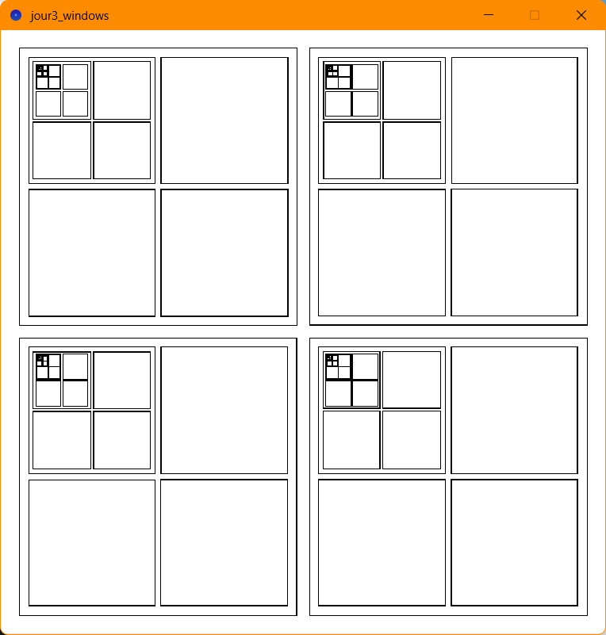
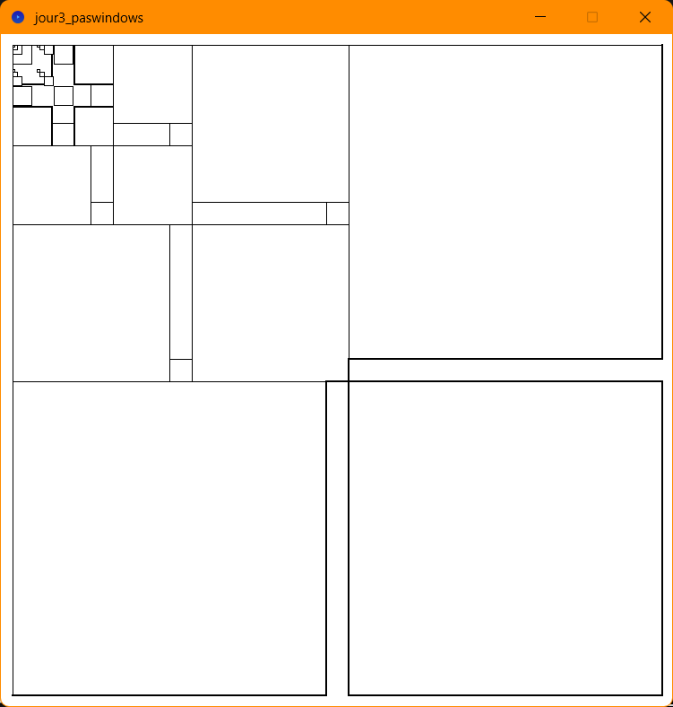
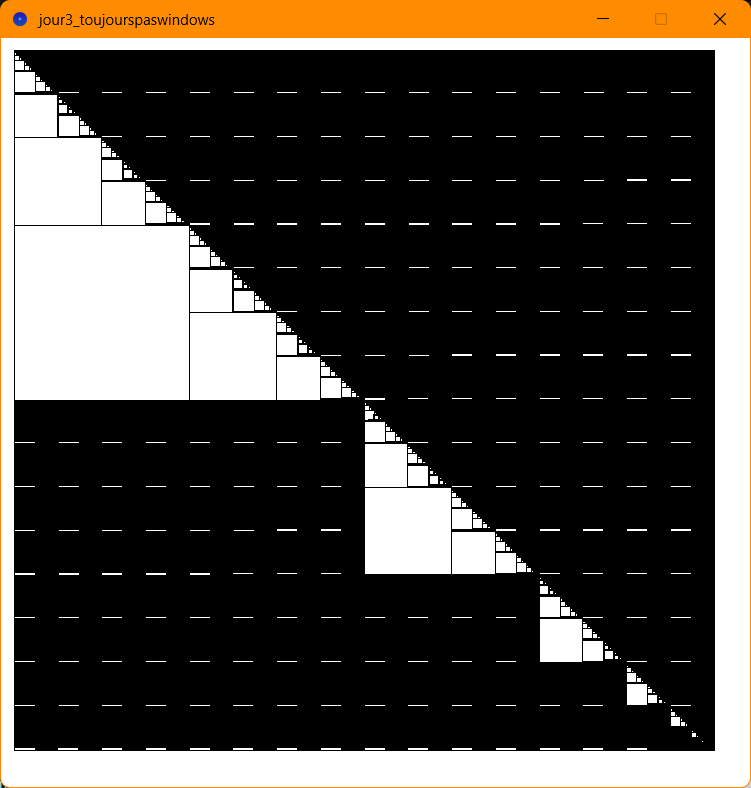
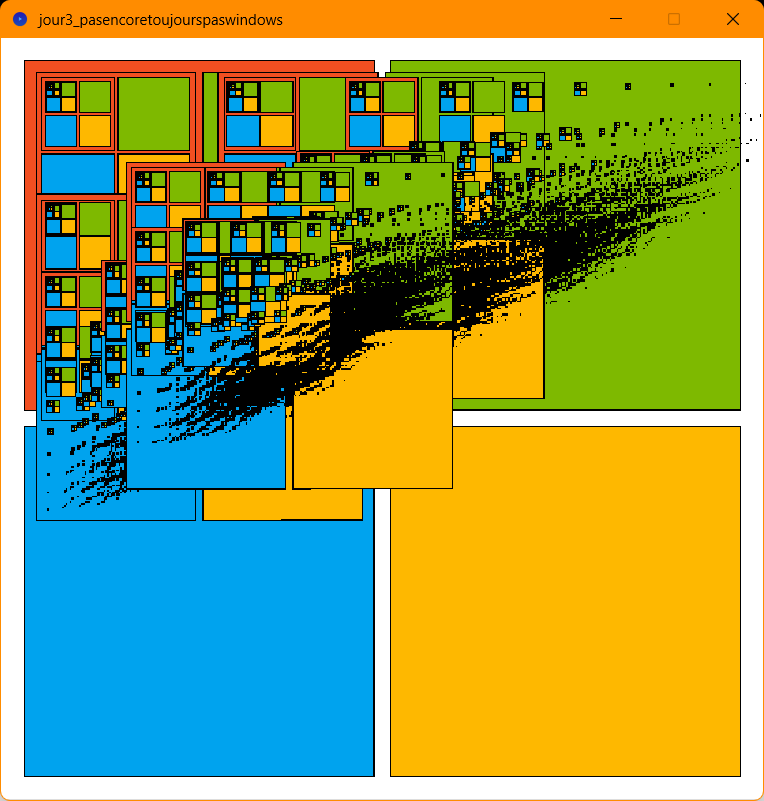
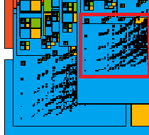
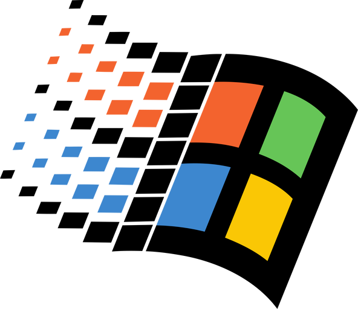
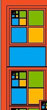
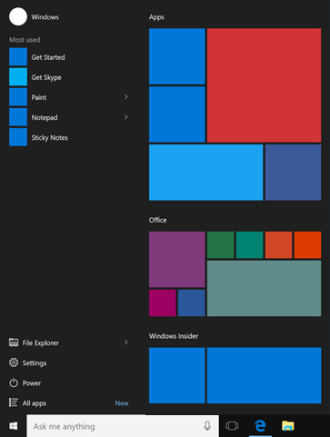
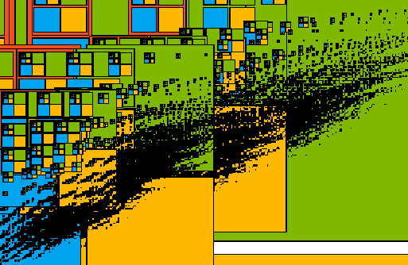
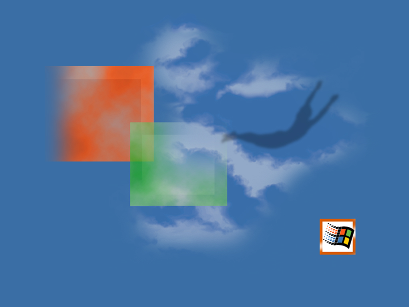

Matthieu FARANDJIS\
E3 IMAC

# Jour 2 - Workshop Esthétiques algorithmiques

---

 
Fractals
   

**Arborescence**\
Fractals\
│   ├── jour3_windows : tentative 1 avec le code Processing\
│   ├── jour3_paswindows : tentative 2 avec le code Processing\
│   ├── jour3_toujourspaswindows : tentative 3 avec le code Processing\
│   ├── jour3_RENDU_pasencoreettoujourspaswindows : tentative 4, la version que je préfère avec le code Processing\
│   ├── screenshots : les captures d'écran
  

---

## Plan

- ## [I – Atelier 3.1](#p1)
  - ### a) Exploration : les fractales
  - ### b) Tentatives
  - ### c) La version originale que j'ai retenue de la fractale

---

##  I - Atelier 3.1
### a) Exploration : les fractales

Je souhaitais reprendre l'idée d'une fractale avec quatre formes où, dans chaque forme, il y a quatre formes, et ainsi de suite.  
Je pensais au logo de Windows 7, mais la forme ne permettait pas la récursivité, alors je me suis résigné au logo de Microsoft.\
\
Faire cette fractale est simple tant que l'on ne gère pas les espaces. Je voulais un espace étroit entre les quatre carrés et large autour.\
C'était beaucoup plus difficile que ce que je pensais, et je n'ai pas réussi. Cependant, j'ai obtenu des résultats intéressants.

   

### b) Tentatives

La première est la plus proche de ce que je voulais faire avant une colorisation.\
Le problème : la récurrence n'apparaît que dans le premier carré des quatre.

*Tentative 1*

La deuxième a un petit charme, mais le bout de la récurrence est bizarre.

*Tentative 2*

La troisième est une fractale mais complètement opposée à ce que je voulais faire.\
Le noir a été formé par des minuscules carrés côte à côte, mais il y a des espaces de différentes épaisseurs, bizarrement.

*Tentative 3*

   

### c) La version originale que j'ai retenue de la fractale
J'en suis arrivé à ma dernière version, car j'aime bien celle-ci.

*Tentative 4 : final*

  

On y retrouve des éléments reflétant ce que je voulais représenter initialement : Microsoft et Windows.\
On retrouve le logo Microsoft avec ses couleurs, un logo qui se déforme progressivement comme s'il se faisait aspirer par quelque chose.\
\
On y retrouve aussi la sorte de traînée du logo de Windows 9x par pure coïncidence, et je trouve ça génial.

*On remarque une traînée noire (à gauche), comme celle du logo de Windows 9x (à droite)*

  

Il y a également un petit aspect menu Démarrer de Windows 10 avec les tuiles colorées.

*Mes carrés (et un rectangle !) (à gauche) comme sur le menu Démarrer de Windows 10 (à droite)*

  
Et enfin, la forme noire m'évoque les nuages ou la personne qui s'envole sur ce fond d'écran de Windows 2000. 

*La forme (à gauche) m'évoquant les nuages ou encore la personne qui s'envole (à droite)*

  
On peut bien sûr avoir différentes interprétations de ma création, mais je la trouve amusante vis-à-vis de ce que j'avais envie de représenter.

\
\
\
\
Remarque : ce rapport a été relu par ChatGPT afin de corriger les dernières fautes d’orthographe restantes. J’ai précisé de conserver la structure de ce que j’avais écrit ; il a uniquement corrigé les fautes et j’ai vérifié ses corrections.
