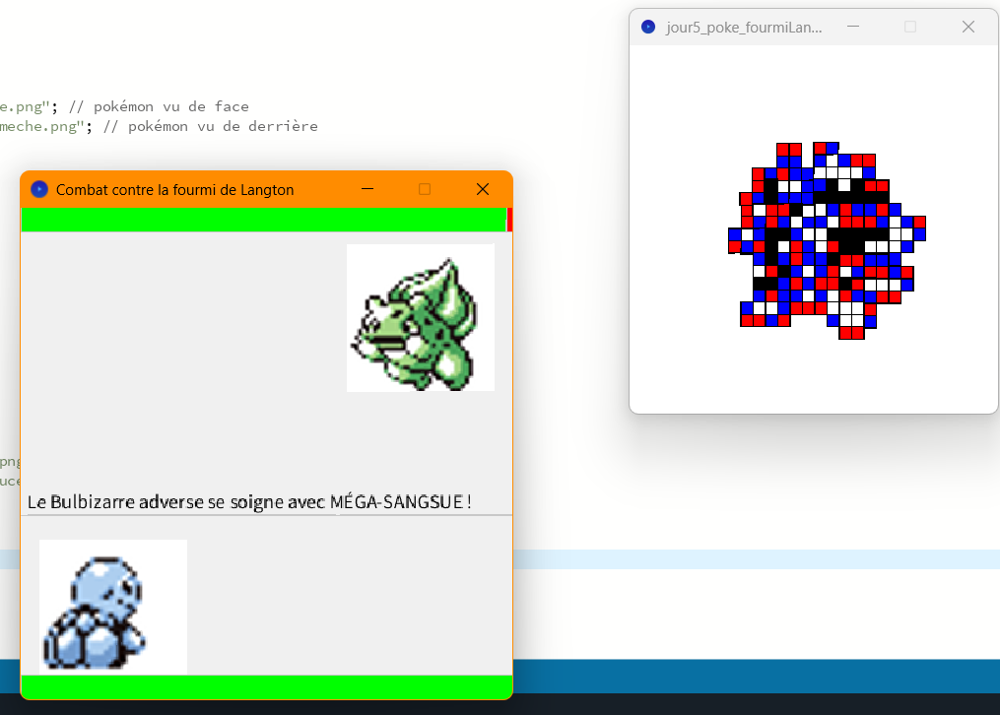
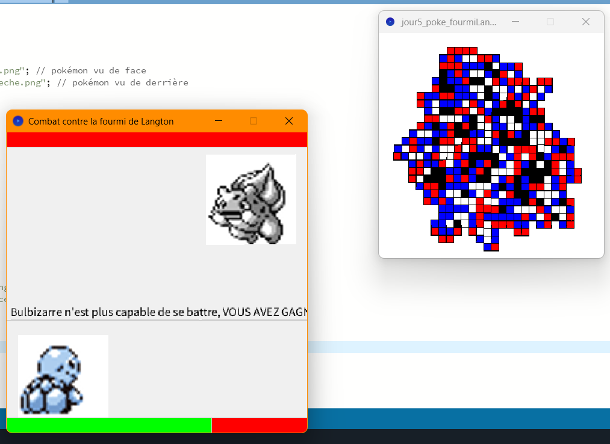
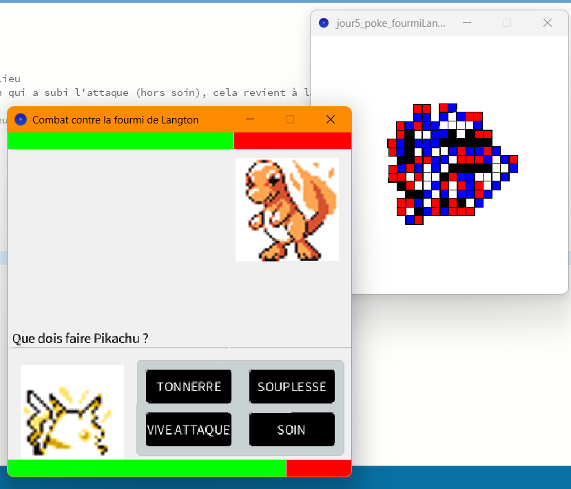
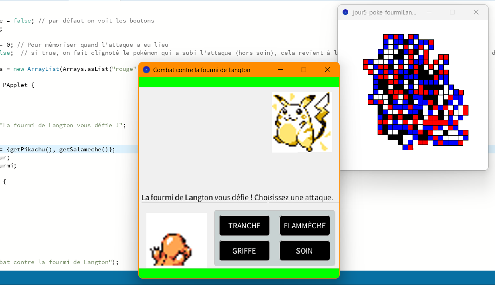
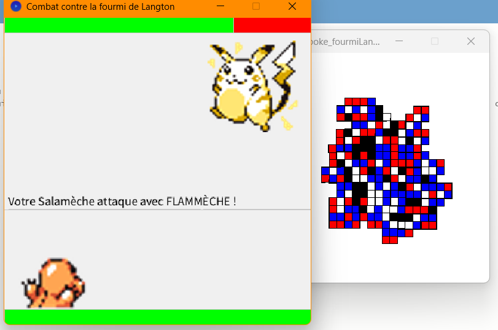
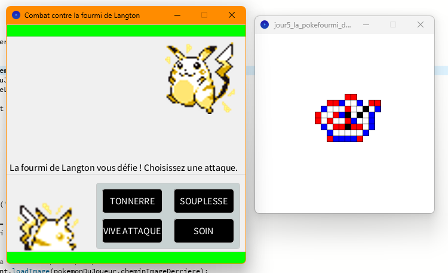

Matthieu FARANDJIS\
E3 IMAC

# Jour 5 - Workshop Esthétiques algorithmiques

---

 
Free
   

**Arborescence**\
Free\
│   ├── jour5_la_pokefourmi_de_Langton : mon projet personnel (Langton édition combat Pokémon)\
│   ├── screenshots : les images

  

---

##  I - Atelier 5 : La Pokéfourmi de Langton

### 1. Présentation
J'avais envie d'aller un peu plus loin avec Processing cette fois-ci.\
Après une très longue réflexion, j'ai repris l'aspect que j'ai le plus aimé du Workshop : l'atelier automate cellulaire (la fourmi de Langton), et
j'ai pris ma licence préférée : Pokémon.

Ça n'a pas été évident avec le peu de temps que je m'étais laissé, alors je me suis aidé de Gemini ou encore de ChatGPT :
- Pour faire apparaître une deuxième fenêtre
- Pour afficher et manipuler des images
- Pour interagir avec l'image
  - le clic de la souris par exemple
- le traitement de données
  - je lui donne la fonction getPikachu() comme exemple, la classe Pokémon, des informations que j'aimerais avoir pour Bulbizarre, et il m'a généré getBulbizarre.

À noter que mon travail fonctionne avec une installation de base de Processing.\
Il y a 3 onglets dans Processing :
- l'algo de la fourmi de Langton
  - la variable `couleurDeLaCaseOuLaFourmiVientDArriver` permet au jeu de récupérer en temps réel la couleur de la case où se trouve la fourmi. C'est cet algorithme qui met à jour la variable
- infoPokemon : classe Pokémon et les fonctions `get[le Pokémon]()`
- jeu_pokemon : le jeu avec sa propre fenêtre

### 1. Déroulement

Le jeu se déroule ainsi :
- Deux fenêtres s'ouvrent :
  - L'une avec la fourmi de Langton à 4 directions
  - L'autre avec le jeu
- Une cinématique se lance avec les deux sprites qui se déplacent, avec un mini texte d'introduction.
  - Il y a deux barres vertes : ce sont les barres de points de vie (celle du haut pour l'adversaire)
- À la fin de la cinématique, le joueur peut lancer l'une des quatre attaques
- Le joueur attaque
- Le menu des attaques s'enlève
- Le jeu calcule les dommages qui auront lieu sur le Pokémon adverse
- Le Pokémon attaqué clignote, on attend
- Le Pokémon adverse attaque
  - Le jeu regarde sur quelle couleur se trouve la fourmi ; elle choisit l'attaque associée à la fourmi (exemple : si rouge, alors ce sera l'attaque 1 du Pokémon)
- De même, le jeu calcule les dégâts, il fait clignoter, on attend, puis c'est notre tour.

Il n'est pas possible de se soigner au-delà de ses points de vie maximum.\
Quand les points de vie sont inférieurs ou égaux à 0, la partie est terminée.
Le Pokémon vainqueur est annoncé à la fin de l'attente. Lors de l'annonce, le Pokémon KO est grisé.

   

### 2. 4 Pokémon disponibles

Les 4 Pokémon (Salamèche, Bulbizarre, Carapuce, Pikachu) sont parfaitement utilisables, que ce soit par la fourmi ou par le joueur.\
Pour changer de Pokémon, il suffit de changer l'appel à la fonction à la ligne 19 dans l'onglet `jeu_pokemon` :
- la case 0, occupée par défaut par `getPikachu()`, correspond à la fourmi
- la case 1, occupée par défaut par `getSalameche()`, correspond au joueur.

Toutes les combinaisons de Pokémon sont possibles, même Pikachu vs Pikachu.

\
\
À ce propos, si vous estimez qu'une attaque revient plus régulièrement qu'une autre et que vous souhaitez inverser cela, c'est tout à fait possible.\
À la ligne 9, vous pouvez échanger de place les couleurs (ATTENTION : tout en minuscules, comme c'est écrit de base).\
- rouge : attaque 1 (indice 0)
- bleu : attaque 2 (indice 1)
- blanc : attaque 3 (indice 2)
- noir : attaque 4 (indice 3)

   

### 3. Améliorations possibles
Il y en a quelques-unes :
- Choisir aléatoirement (via la fourmi) qui commence
- Laisser le choix au joueur de choisir son Pokémon (avant la fourmi)
- Laisser la fourmi choisir (après le joueur, car sinon ce sera toujours le même Pokémon, logiquement)
- Ajouter des animations
- Rendre plus belle l'interface
- Ajouter une musique (si c'est possible avec Processing)
- Ajouter des Pokémon
- Corriger les phrases qui sont coupées.

### 4. Images

À noter que le fond blanc sur les Pokémon a été enlevé sur la version actuellement disponible sur le dépôt.

*Bulbizarre utilise une attaque qui lui permet de se soigner un peu, mais pas complètement.*

   

*Bulbizarre est KO : son sprite est grisé, sa barre de vie est vidée, et le texte de victoire dépasse.*

   

*Menu de sélection des attaques : on remarque que cette fois-ci, c'est Pikachu vs Salamèche.*

   

*Maintenant, c'est Salamèche vs Pikachu, comme le montre la ligne de code avec getPikachu() et getSalameche().*

   

*Salamèche attaque.*

   

*Pikachu vs Pikachu.*

   

Remarque : ce rapport a été relu par ChatGPT afin de corriger les dernières fautes d’orthographe restantes. J’ai précisé de conserver la structure de ce que j’avais écrit ; il a uniquement corrigé les fautes et j’ai vérifié ses corrections.\
